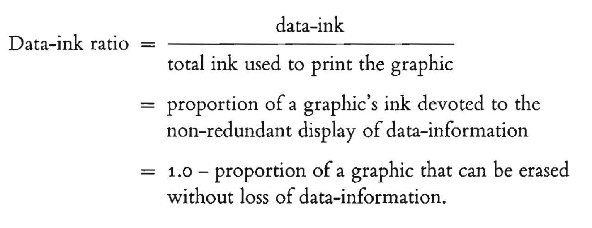

# Theory

> “Graphical excellence is that which gives to the viewer the greatest number 
> of ideas in the shortest time with the least ink in the smallest space.”
>
> — Edward Tufte, The Visual Display of Quantitative Information (2nd ed.)

## The Data-Ink Ratio

The data-ink ratio, proposed in Edward Tufte's *[The Visual Display of Quantitative Information (2nd ed.)](https://www.edwardtufte.com/book/the-visual-display-of-quantitative-information/)* is a very helpful concept to avoid unnecessary noise in your plots:



The goal of the data-ink ratio is 5-fold:

> 1. Above all else show the data.
> 2. Maximize the data-ink ratio.
> 3. Erase non-data-ink.
> 4. Erase redundant data-ink.
> 5. Revise and edit.

Here is an example of a **low data-ink** ratio plot that could use some cleaning up. Admittedly, this is a bit exaggerated, but its not far off from what is found in many scientific publications:

```{r}
#| echo: false

library(ggplot2)

df <- data.frame(
  category = c("A", "B", "C", "D", "E"),
  value = c(12, 19, 7, 25, 16)
)

ggplot(df, aes(x = category, y = value, fill = category)) +
  geom_col(width = 0.6, color = "black", linewidth = 1) +
  geom_hline(yintercept = seq(0, 30, by = 2), color = "grey85", linewidth = 0.4) +
  geom_text(aes(label = value), vjust = -0.8, size = 5, fontface = "bold") +
  scale_y_continuous(breaks = seq(0, 30, by = 2), limits = c(0, 30)) +
  theme_minimal(base_size = 14) +
  theme(
    panel.grid.major.x = element_line(color = "grey70", linewidth = 0.8),
    panel.grid.major.y = element_blank(),
    panel.grid.minor = element_blank(),
    axis.line = element_line(color = "black", linewidth = 0.8),
    legend.position = "bottom",
    plot.title = element_text(face = "bold"),
    plot.background = element_rect(fill = "grey97", color = "grey60", linewidth = 1),
    panel.border = element_rect(color = "black", fill = NA, linewidth = 1)
  )
```

A few aspects of this plot can be adjusted:

- Do we need thick, multi-colored bars to convey our information?
- Do grid lines add anything to the plot?
- Does the legend add anything to the plot?
- Does the axis labels add anything to the plot?

Here is an example of the same data, but with a **maximized data-ink** ratio:

```{r}
#| echo: false

ggplot(df, aes(x = category, y = value)) +
  geom_segment(aes(x = category, xend = category, y = 0, yend = value),
               color = "#4E79A7", linewidth = 1) +
  geom_point(color = "#4E79A7", size = 2) +
  geom_text(aes(label = value), vjust = -0.6, size = 4) +
  expand_limits(y = max(df$value) + 3) +
  theme_minimal(base_size = 14) +
  theme(
    panel.grid.major.x = element_blank(),
    panel.grid.minor = element_blank(),
    axis.title = element_blank(),
    axis.ticks = element_blank()
  )
```

## Colors and Fonts

Two of the most important design choices in a visualization are color and typography. These choices can either support the data or distract from it.

```{css, echo=FALSE}
.bad-demo {
  background: #CC0035;
  color: #354CA1;
  padding: 1.2rem;
  border: 4px dashed #59C3C3;
  font-family: "Comic Sans MS", "Courier New", cursive;
  line-height: 1.1;
}

.bad-demo h3 {
  color: #F9C80E;
  text-transform: uppercase;
}

.bad-demo p, .bad-demo li {
  font-size: 0.75rem;
}

.bad-title {
  font-family: "Papyrus", fantasy;
  font-size: 1.4rem;
}

.bad-body {
  font-family: "Courier New", monospace;
}

.bad-emphasis-1 {
  font-family: "Times New Roman", serif;
  font-style: italic;
}

.bad-emphasis-2 {
  font-family: Arial, sans-serif;
  text-transform: uppercase;
  letter-spacing: 0.05em;
}

.bad-emphasis-3 {
  font-family: "Brush Script MT", cursive;
}

.good-demo {
  background: #354CA1;
  color: #ffffff;
  padding: 0.05rem 1rem 1rem 1rem;
  border-radius: 8px;
  font-family: system-ui, -apple-system, Segoe UI, Roboto, sans-serif;
  line-height: 1.5;
}

.good-demo h3 {
  color: #ffffff;
}

.best-demo {
  background: #f8f9fa;
  color: #222222;
  padding: 0.05rem 1rem 1rem 1rem;
  border-radius: 8px;
  font-family: system-ui, -apple-system, Segoe UI, Roboto, sans-serif;
  line-height: 1.5;
}

.best-demo h3 {
  color: #111111;
}
```

### Bad Example

::: {.bad-demo}

<div class="bad-title">Color</div>

<div class="bad-body">
Color should be used intentionally. Its main job is not to decorate the plot, but to help the viewer understand what matters.
</div>

<div class="bad-emphasis-2">A few useful guidelines:</div>

<ol class="bad-body">
<li><span class="bad-emphasis-1">Use color to highlight important parts of the data.</span>  
Color is most effective when it draws attention to a key pattern, category, or comparison rather than coloring everything equally.</li>

<li><span class="bad-emphasis-3">Avoid flashy colors, and make sure contrast to the background isn’t harsh.</span>  
Extremely bright or saturated colors can be distracting. Softer, deliberate color choices are usually easier to look at and help keep the focus on the data.</li>

<li><span class="bad-emphasis-2">When you have to stick to poor branding, capitalize on using blacks and whites.</span>  
If required institutional or brand colors are not ideal for data visualization, neutral tones can help balance the design and reduce visual clutter.</li>

<li><span class="bad-emphasis-1">Make considerations for color blindness.</span> Avoid relying on color alone to communicate meaning. When possible, use accessible palettes and reinforce distinctions with labels, position, or shape.</li>
</ol>

<div class="bad-title">Font</div>

<div class="bad-body">
Typography should support readability and visual hierarchy without calling attention to itself.
</div>

<div class="bad-emphasis-2">Some general principles:</div>

<ol class="bad-body">
<li><span class="bad-emphasis-3">The default is usually fine.</span>  
You rarely need a special font to make a good chart. Clear and familiar fonts are often the best choice.</li>

<li><span class="bad-emphasis-1">Use italics, bolding, caps, and size instead of multiple fonts.</span>  
These tools are usually enough to create emphasis and structure while keeping the design consistent.</li>

<li><span class="bad-emphasis-2">Use a color that contrasts your background, usually black or white.</span>  
Text should be easy to read at a glance. In most cases, high-contrast text is the safest and clearest option.</li>

<li><span class="bad-emphasis-3">Don’t make your text so small that it’s hard to read.</span> Labels, titles, and annotations are only useful if your audience can comfortably read them.</li>
</ol>

<div class="bad-body">
Good use of color and font should feel almost invisible: they should guide attention, improve clarity, and stay out of the way of the data.
</div>

:::

---

### Good Example (Branded)

::: {.good-demo}
### Color {.unnumbered}

Color should be used intentionally. Its main job is not to decorate the plot, but to help the viewer understand what matters.

A few useful guidelines:

1. **Use color to highlight important parts of the data.** Color is most effective when it draws attention to a key pattern, category, or comparison rather than coloring everything equally.

2. **Avoid flashy colors, and make sure contrast with the background is not too harsh.** Extremely bright or saturated colors can be distracting. Softer, deliberate color choices are usually easier to look at and help keep the focus on the data.

3. **When you have to stick to poor branding choices, make use of black, white, and grayscale.** If required institutional or brand colors are not ideal for data visualization, neutral tones can help balance the design and reduce visual clutter.

4. **Make considerations for color blindness.** Avoid relying on color alone to communicate meaning. When possible, use accessible palettes and reinforce distinctions with labels, position, or shape.

### Font {.unnumbered}

Typography should support readability and visual hierarchy without calling attention to itself.

Some general principles:

1. **The default is usually fine.** You rarely need a special font to make a good chart. Clear and familiar fonts are often the best choice.

2. **Use italics, bolding, capitalization, and size before introducing multiple fonts.** These tools are usually enough to create emphasis and structure while keeping the design consistent.

3. **Use a font color that contrasts with the background, usually black or white.** Text should be easy to read at a glance. In most cases, high-contrast text is the safest and clearest option.

4. **Do not make your text so small that it becomes hard to read.** Labels, titles, and annotations are only useful if your audience can comfortably read them.

Good use of color and font should feel almost invisible: they should guide attention, improve clarity, and stay out of the way of the data.

:::

### Best Example (Neutral)

::: {.best-demo}
### Color {.unnumbered}

Color should be used intentionally. Its main job is not to decorate the plot, but to help the viewer understand what matters.

A few useful guidelines:

1. **Use color to highlight important parts of the data.** Color is most effective when it draws attention to a key pattern, category, or comparison rather than coloring everything equally.

2. **Avoid flashy colors, and make sure contrast with the background is not too harsh.** Extremely bright or saturated colors can be distracting. Softer, deliberate color choices are usually easier to look at and help keep the focus on the data.

3. **When you have to stick to poor branding choices, make use of black, white, and grayscale.** If required institutional or brand colors are not ideal for data visualization, neutral tones can help balance the design and reduce visual clutter.

4. **Make considerations for color blindness.** Avoid relying on color alone to communicate meaning. When possible, use accessible palettes and reinforce distinctions with labels, position, or shape.

### Font {.unnumbered}

Typography should support readability and visual hierarchy without calling attention to itself.

Some general principles:

1. **The default is usually fine.** You rarely need a special font to make a good chart. Clear and familiar fonts are often the best choice.

2. **Use italics, bolding, capitalization, and size before introducing multiple fonts.** These tools are usually enough to create emphasis and structure while keeping the design consistent.

3. **Use a font color that contrasts with the background, usually black or white.** Text should be easy to read at a glance. In most cases, high-contrast text is the safest and clearest option.

4. **Do not make your text so small that it becomes hard to read.** Labels, titles, and annotations are only useful if your audience can comfortably read them.

Good use of color and font should feel almost invisible: they should guide attention, improve clarity, and stay out of the way of the data.

:::

## SMU Brand Guidelines

SMU Marketing and Communications publishes brand guidelines that should be used for any public-facing marketing content. Even for internal products, following brand guidelines is always a good idea, as long as it doesn't take away from the visualization. Some journals may also have brand guidelines you need to follow.

SMU Brand Guidelines: [https://www.smu.edu/brand](https://www.smu.edu/brand)
