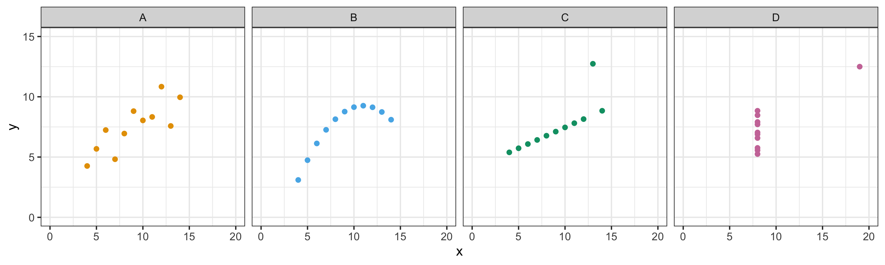
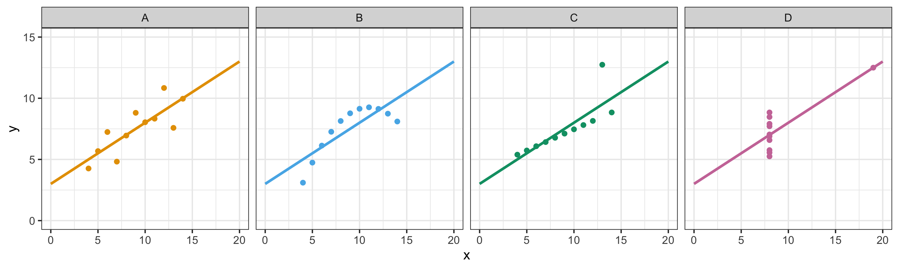
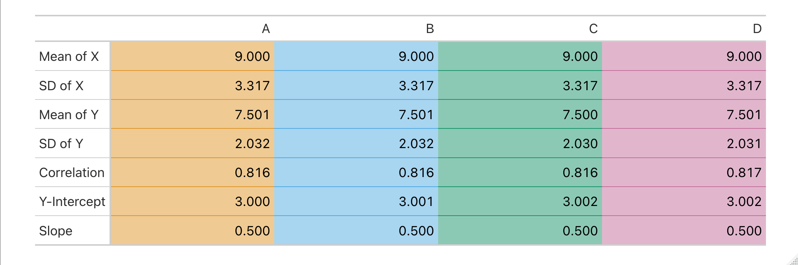
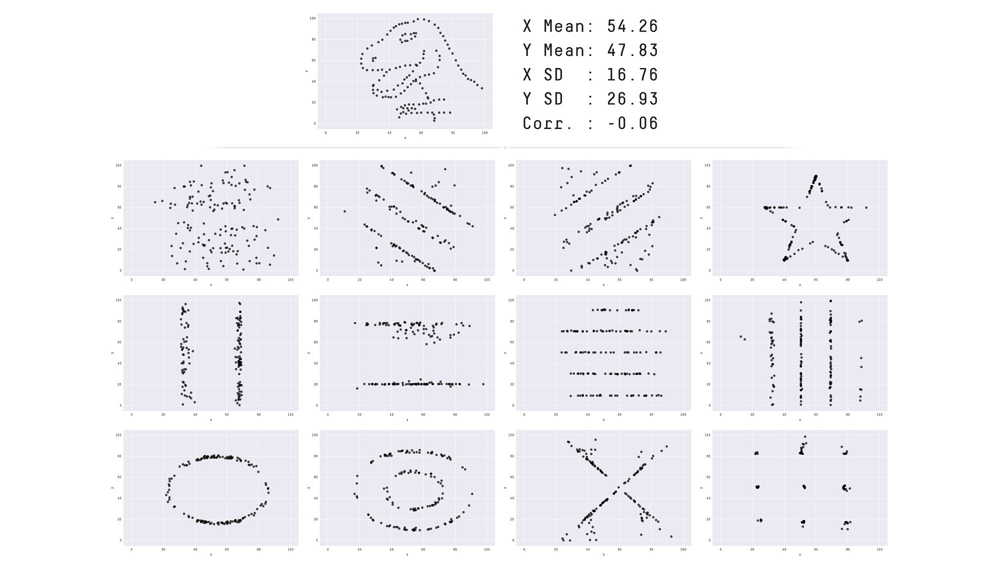

# Why Visualize?

> “Graphical excellence is that which gives to the viewer the greatest number 
> of ideas in the shortest time with the least ink in the smallest space.”
>
> — Edward Tufte, The Visual Display of Quantitative Information (2nd ed.)

## Anscombe's Quartet

A famous example that illustrates why visualizing your data is important is Anscombe's Quartet.
Looking at the 4 plots below, what do you notice?

Here are the same 4 plots, with a "best fit" line draw through them. Notice they all fit the exact same line.

Here are statistical summaries of the data in each plot. What do you notice?

## The Datasaurus Dozen

Another classic, slightly more fun example is the Datasaurus Dozen, which all have the same statistical properties:

To see more: [https://www.research.autodesk.com/publications/same-stats-different-graphs/](https://www.research.autodesk.com/publications/same-stats-different-graphs/)

## Summary

- To efficiently communicate ideas
- Some patterns can only be seen visually
- Aesthetics sell better than facts. See [this paper](https://doi.org/10.1016/j.ijresmar.2019.03.002) on the aesthetic fidelity effect.
- To make data more ingestible